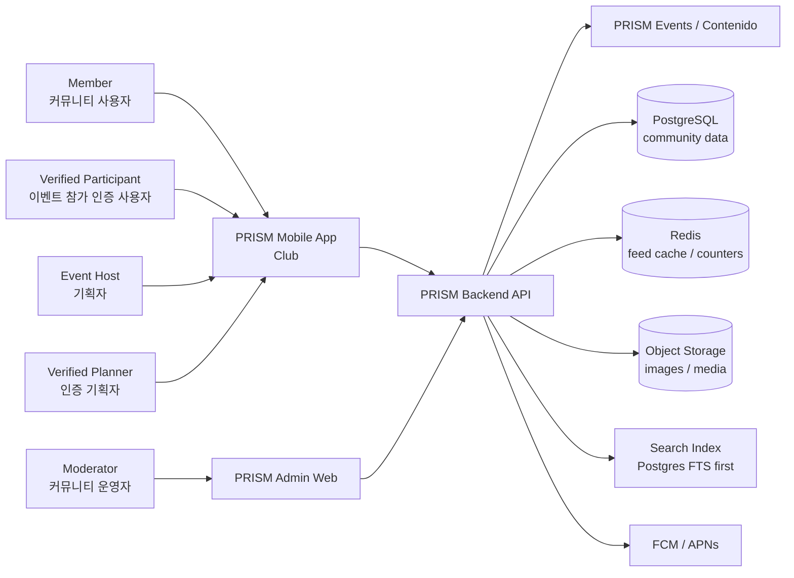
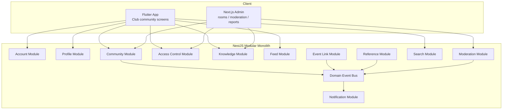
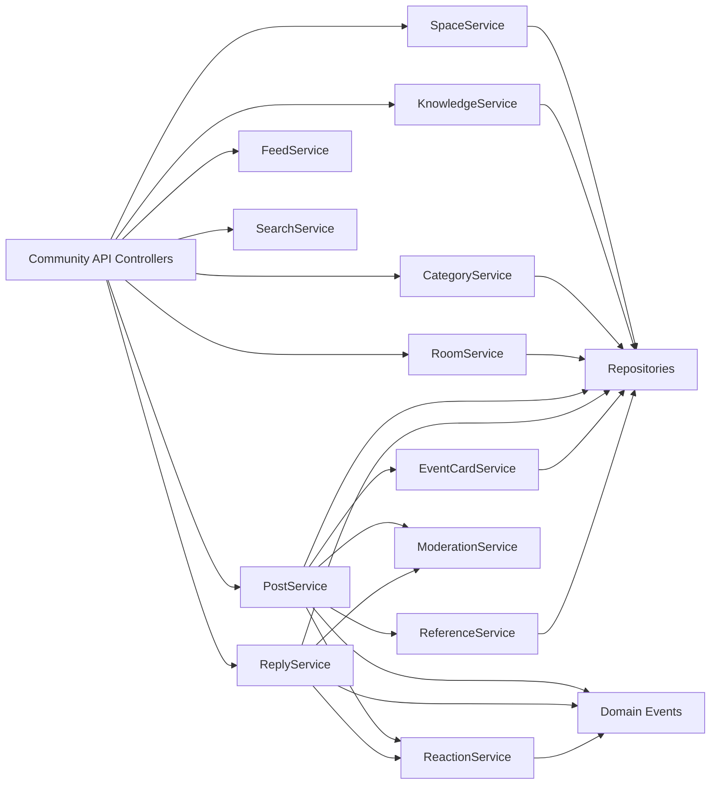
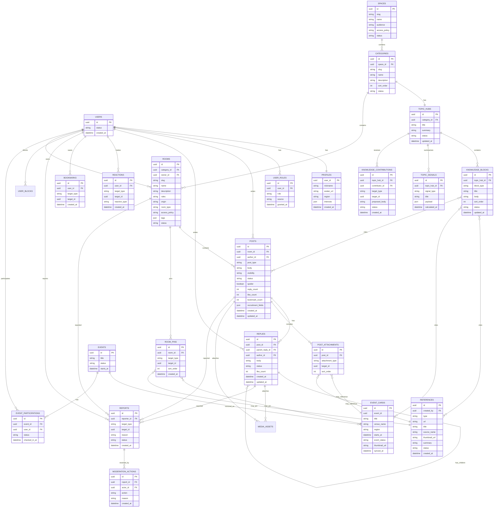
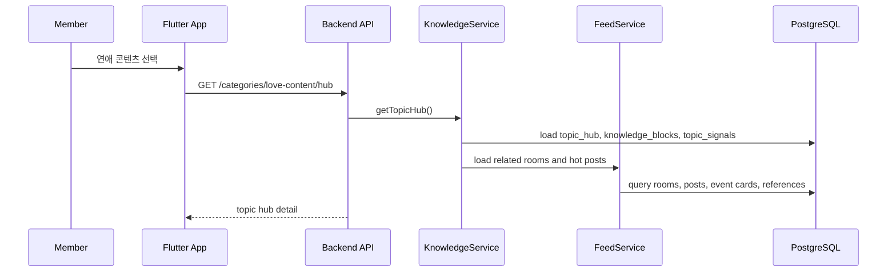
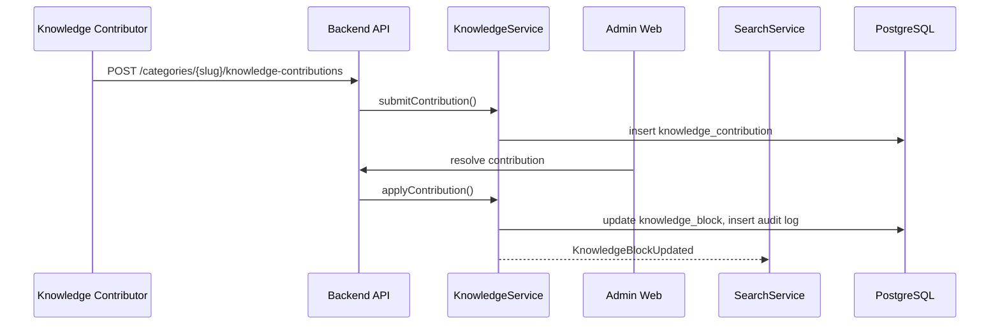
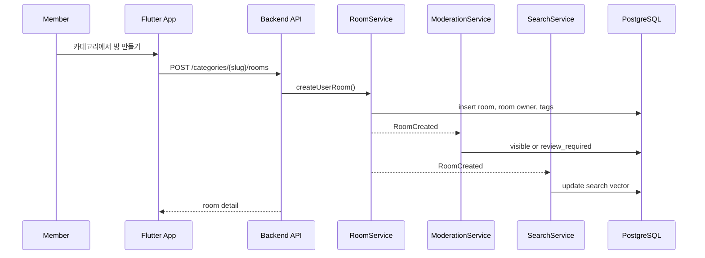
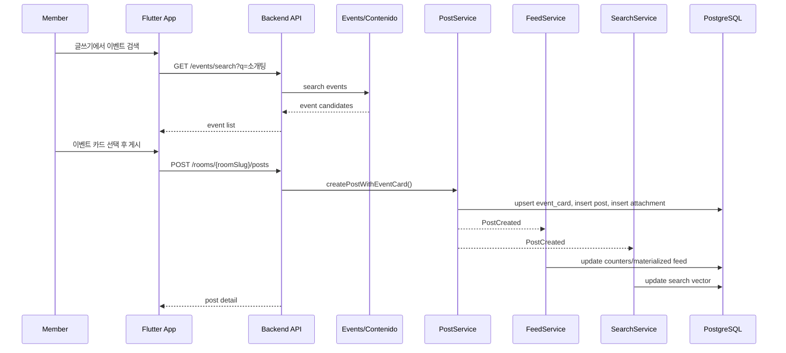
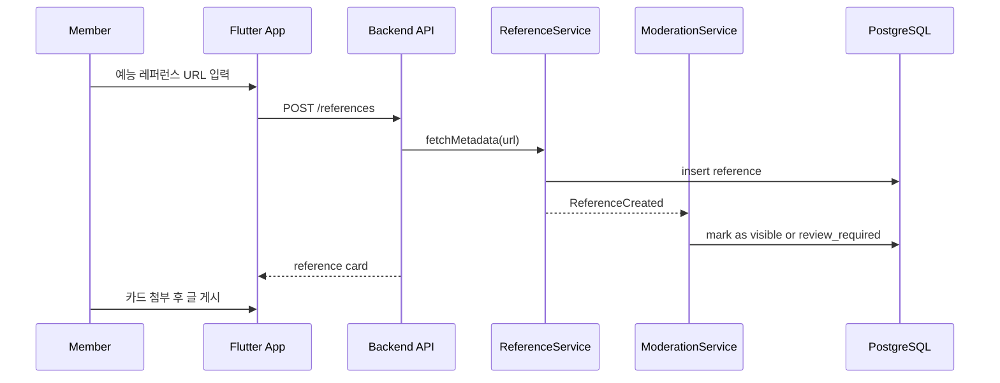
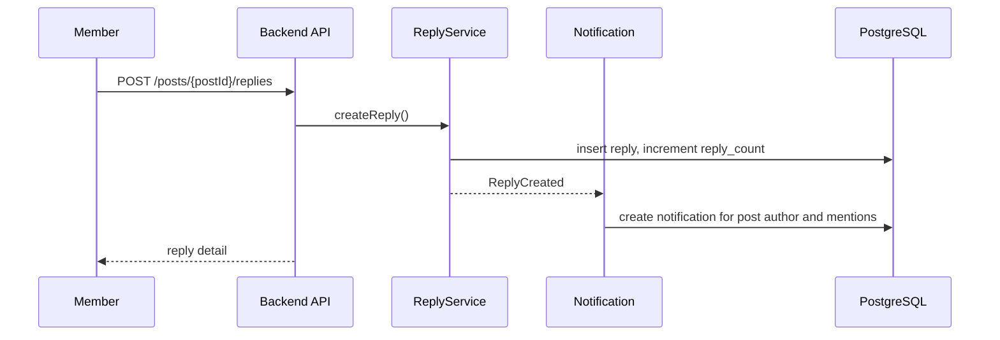

# Architecture and Data Design

## 1. 설계 원칙

1. 주제 정보 허브를 1급 도메인으로 둔다: Category는 단순 게시판명이 아니라 Topic Hub를 가진다.
2. 주제 구조를 1급 도메인으로 둔다: Space, Category, TopicHub, Room, Post, Reply가 Club의 핵심이다.
3. 유저 생성 방을 기본 모델로 둔다: 운영자 기본 방과 사용자 생성 방은 같은 Room 모델을 쓰되 `origin`과 권한으로 구분한다.
4. 참가자/기획자 커뮤니티를 권한으로 분리한다: 기획자 전용 카테고리와 방은 서버 권한 검사로 보호한다.
5. 이벤트 연동은 카드화한다: Events/Contenido의 이벤트 원본은 Events가 소유하고, Club은 참조 카드와 토론 맥락을 가진다.
6. 레퍼런스는 별도 자산으로 관리한다: 외부 링크, 예능 프로그램, 영상, 룰 문서, 아이디어를 검색 가능한 Reference로 저장한다.
7. 방은 대표 자료를 가질 수 있다: 방 소유자는 대표 이벤트 카드와 대표 레퍼런스를 고정해 대화 맥락을 만든다.
8. 지식과 대화를 분리하되 연결한다: KnowledgeBlock은 정리된 정보, Post/Reply는 대화 원장이다.
9. 타임라인은 원장과 집계를 분리한다: 게시글/댓글 원장은 PostgreSQL, 인기순/홈피드는 Redis 캐시나 materialized view로 최적화한다.
10. 커뮤니티 안전을 기본 기능으로 둔다: 신고, 숨김, 차단, 금칙어, 운영자 감사 로그를 MVP부터 포함한다.
11. 향후 기록/배지/랭킹은 보조 모듈로 붙인다: Club의 중심은 지식 허브와 대화다.

## 2. 시스템 컨텍스트



## 3. 컨테이너 구조



## 4. Community 내부 컴포넌트



## 5. 데이터 모델 초안



## 6. 주요 API 초안

| Method | Path | 설명 |
| --- | --- | --- |
| `GET` | `/v1/categories` | 카테고리 목록 |
| `GET` | `/v1/spaces` | 참가자/기획자 커뮤니티 목록 |
| `GET` | `/v1/categories/{categorySlug}/hub` | Topic Hub 조회 |
| `POST` | `/v1/categories/{categorySlug}/knowledge-contributions` | Topic Hub 정보 개선 제안 |
| `POST` | `/v1/admin/knowledge-contributions/{id}/resolve` | 지식 기여 승인/거절 |
| `GET` | `/v1/categories/{categorySlug}/rooms` | 카테고리별 방 목록 |
| `POST` | `/v1/categories/{categorySlug}/rooms` | 유저 생성 방 만들기 |
| `GET` | `/v1/rooms/{roomSlug}` | 방 상세와 규칙 |
| `PATCH` | `/v1/rooms/{roomSlug}` | 방 소유자/운영자 방 정보 수정 |
| `POST` | `/v1/rooms/{roomSlug}/pins` | 방 대표 이벤트/레퍼런스 고정 |
| `GET` | `/v1/rooms/{roomSlug}/timeline` | 방 타임라인 |
| `POST` | `/v1/rooms/{roomSlug}/posts` | 게시글 작성 |
| `GET` | `/v1/posts/{postId}` | 게시글 상세와 댓글 |
| `PATCH` | `/v1/posts/{postId}` | 게시글 수정 |
| `DELETE` | `/v1/posts/{postId}` | 게시글 삭제 |
| `POST` | `/v1/posts/{postId}/replies` | 댓글 작성 |
| `POST` | `/v1/replies/{replyId}/replies` | 대댓글 작성 |
| `POST` | `/v1/reactions` | 좋아요 등 반응 |
| `POST` | `/v1/bookmarks` | 저장 |
| `GET` | `/v1/events/search` | Events/Contenido 이벤트 검색 proxy |
| `POST` | `/v1/event-cards` | 이벤트 카드 생성/동기화 |
| `POST` | `/v1/references` | 레퍼런스 카드 생성 |
| `GET` | `/v1/search` | 통합 검색 |
| `POST` | `/v1/reports` | 신고 |
| `GET` | `/v1/admin/moderation/reports` | 신고 큐 |
| `POST` | `/v1/admin/moderation/actions` | 운영자 처리 |
| `POST` | `/v1/admin/users/{userId}/roles` | 기획자/운영자 권한 부여 |

## 7. 도메인 이벤트

| 이벤트 | 발행 주체 | 소비 주체 |
| --- | --- | --- |
| `PostCreated` | PostService | FeedService, SearchService, Notification |
| `RoomCreated` | RoomService | FeedService, SearchService, ModerationService |
| `RoomPinned` | RoomService | FeedService, SearchService |
| `KnowledgeContributionSubmitted` | KnowledgeService | Admin Queue |
| `KnowledgeBlockUpdated` | KnowledgeService | SearchService, FeedService |
| `TopicSignalUpdated` | KnowledgeService | FeedService |
| `ReplyCreated` | ReplyService | Notification, FeedService |
| `ReactionCreated` | ReactionService | CounterService, Notification |
| `ReferenceCreated` | ReferenceService | SearchService, ModerationService |
| `EventCardAttached` | EventCardService | Event Analytics, FeedService |
| `ContentReported` | ModerationService | Admin Queue |
| `ModerationActionApplied` | ModerationService | FeedService, SearchService, Notification |

## 8. 데이터 흐름: Topic Hub 조회



## 9. 데이터 흐름: Topic Hub 정보 기여



## 10. 데이터 흐름: 유저 생성 방 개설



## 11. 데이터 흐름: 이벤트 카드를 첨부한 글 작성



## 12. 데이터 흐름: 레퍼런스 공유



## 13. 데이터 흐름: 댓글/대댓글 알림



## 14. 검색 전략

MVP는 PostgreSQL full-text search로 시작한다.

검색 대상:

1. 카테고리 이름과 설명
2. Topic Hub 제목, 요약, 지식 블록
3. 방 이름, 설명, 규칙
4. 게시글 본문
5. 댓글 본문
6. 이벤트 카드 제목, 장소, 지역
7. 레퍼런스 제목, 출처, 요약
8. 모집 글의 역할, 지역, 일정

확장 기준:

| 상황 | 확장 |
| --- | --- |
| 검색 대상 100만 건 이상 | OpenSearch/Meilisearch 검토 |
| 형태소/한글 검색 품질 필요 | 한국어 tokenizer 도입 |
| 추천 피드 필요 | 별도 ranking pipeline |

## 15. 인기순 계산 초안

```text
hot_score =
  like_count * 3
  + reply_count * 5
  + bookmark_count * 4
  + event_card_bonus
  + reference_bonus
  - report_penalty
  - time_decay
```

주의:

1. 신고가 일정 수 이상이면 인기 피드에서 즉시 제외한다.
2. 이벤트 카드가 붙은 글은 이벤트 상세/관련 방에서 더 잘 노출한다.
3. 레퍼런스 글은 오래 지나도 검색 가치가 있으므로 time decay를 낮게 둘 수 있다.
4. 최종 점수는 서버에서 계산하고 클라이언트는 정렬 기준만 요청한다.

## 16. Topic Hub 데이터 신호

```text
topic_signal =
  saved_reference_count
  + event_card_mentions
  + verified_review_count
  + high_reply_threads
  + curator_selected_items
```

초기 Topic Hub 데이터 신호:

| 신호 | 설명 |
| --- | --- |
| 인기 레퍼런스 | 저장/첨부가 많은 레퍼런스 |
| 많이 언급된 이벤트 | 게시글과 댓글에서 자주 연결된 이벤트 |
| 뜨거운 쟁점 | 댓글과 대댓글이 많이 달린 주제 |
| 인증 후기 요약 | 참가 인증 후기에서 자주 등장하는 키워드 |
| 기획 팁 후보 | 기획자 커뮤니티에서 저장이 많은 정보 글 |

## 17. 장애 대응

| 상황 | 대응 |
| --- | --- |
| 이벤트 검색 실패 | 사용자가 직접 링크/제목으로 일반 글 작성 가능 |
| 이벤트 카드 동기화 실패 | 마지막으로 저장된 카드 정보를 보여주고 재동기화 job 실행 |
| 레퍼런스 메타데이터 수집 실패 | 제목/설명 수동 입력 허용 |
| 지식 기여 품질 저하 | Curator 승인 전까지 Topic Hub에 미반영 |
| Topic Hub 데이터 신호 계산 실패 | 마지막 계산 결과를 보여주고 배치 재실행 |
| 유저 생성 방 스팸 증가 | rate limit, 중복 제목 감지, 임시 검수 상태 |
| 기획자 권한 오부여 | role audit log, 운영자 재검수, 권한 회수 |
| 게시글 작성 후 피드 반영 지연 | 작성자는 즉시 optimistic UI, 서버 재조회로 보정 |
| 신고 폭주 | 자동 임시 숨김과 운영자 우선순위 큐 |
| 검색 인덱스 누락 | PostgreSQL 원장 기준 재색인 가능 |
