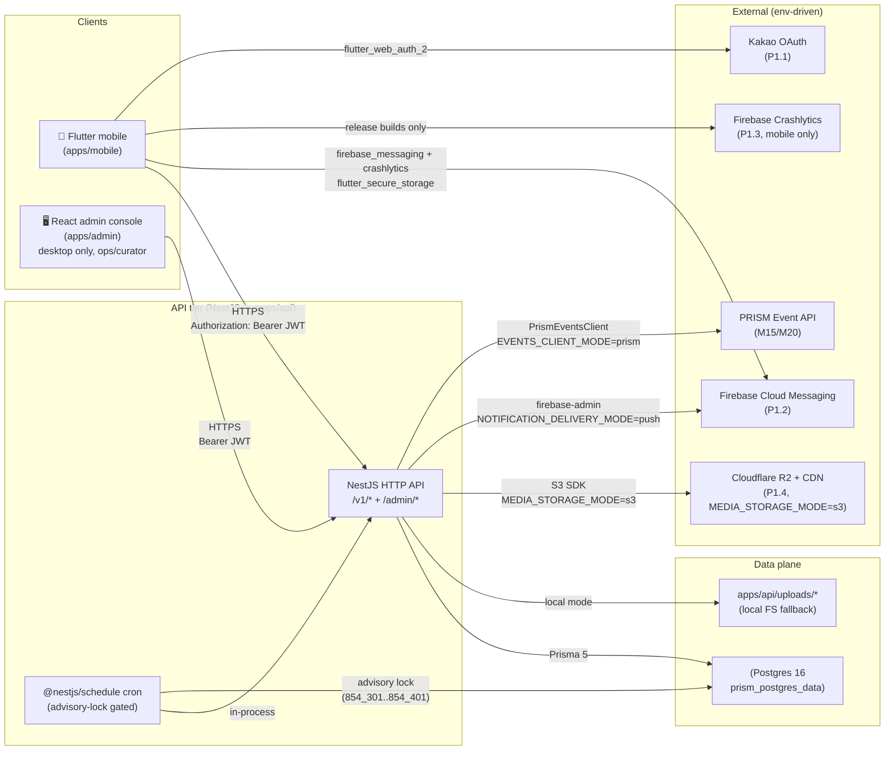
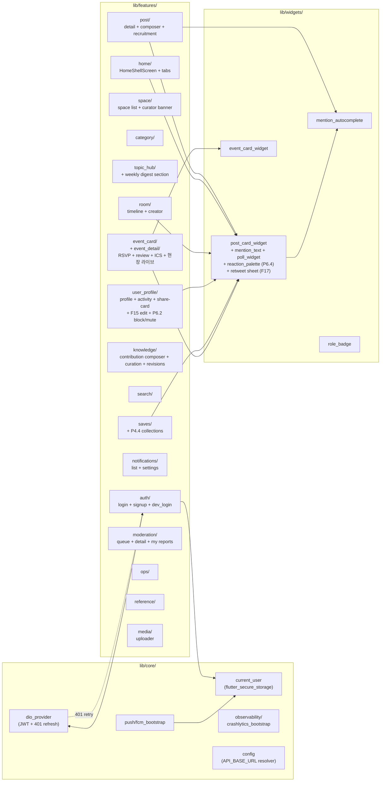
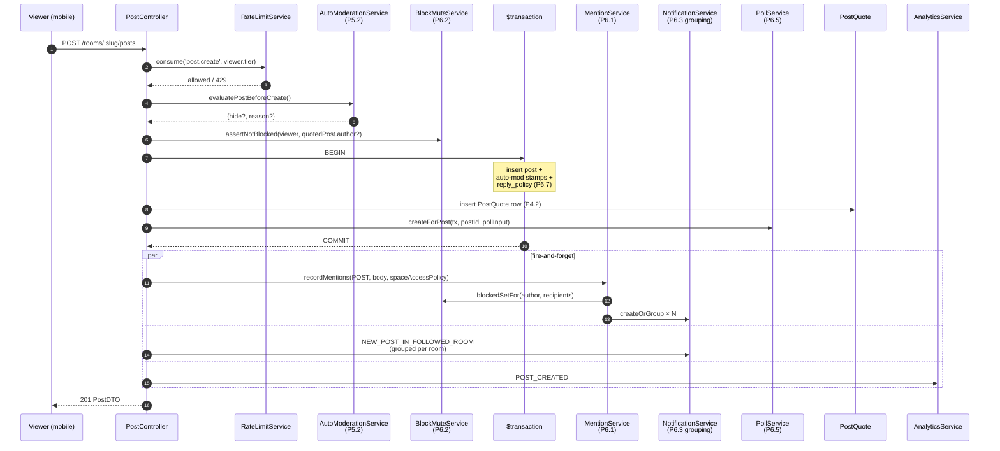
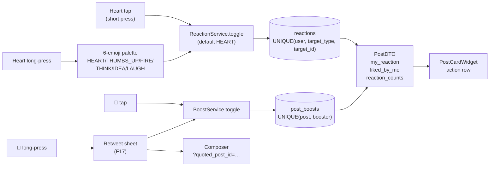
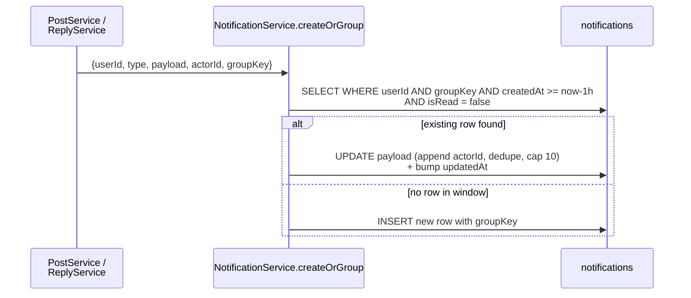
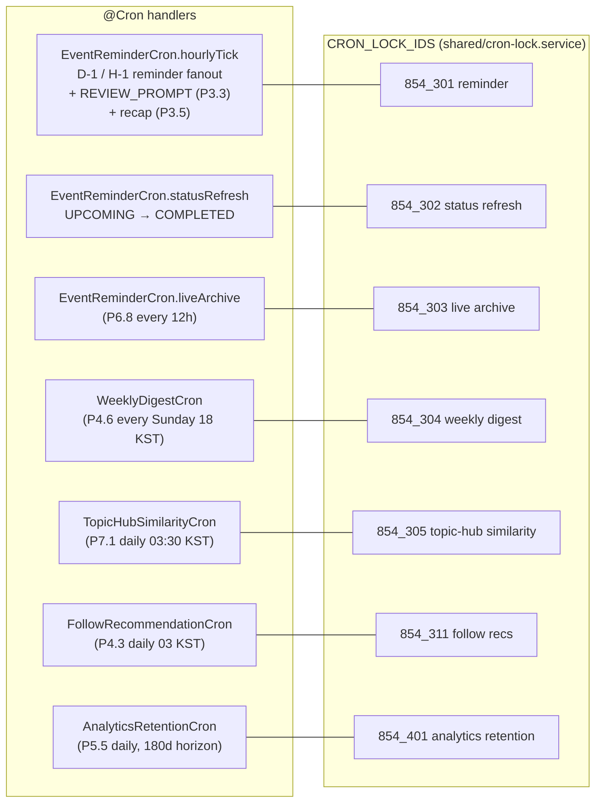
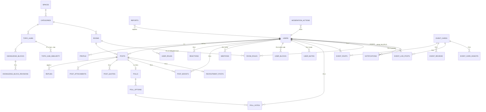

# PRISM Club — Architecture Overview (Phase 1–7 + F-series)

> **Canonical current-state architecture document.** Other architecture
> texts in this folder are scoped or historical:
>
> - `03_ARCHITECTURE_AND_DATA.md` — original spec (M0-era).
> - `docs/architecture/01..08-*.mmd` + `.png` — the rendered Mermaid
>   sources for the diagrams below; treat them as part of this doc.
> - When current-state and the M0 spec disagree, this doc wins.
>
> Render note: all diagrams below are Mermaid blocks. GitHub, VSCode (with
> the Mermaid extension), and most modern markdown viewers render them
> inline. PNG renders live next to the sources in `docs/architecture/`.

Current-state architecture as of the Phase 6 (Sprint A–D) + F-series follow-ups
landing. This doc supplements `03_ARCHITECTURE_AND_DATA.md` (original spec) with
what actually shipped after Beta-prep + the Phase 6 "SNS 경쟁력 보완" iteration.

---

## 1. System view (what runs where)



Key boundaries:
- **API is the only writer to Postgres.** Cron handlers live inside the same
  Nest process and reuse `PrismaService` directly — single-instance enforcement
  is via `pg_try_advisory_lock` per handler (see §6).
- **Mobile never talks to FCM directly.** It receives push from Firebase, but
  the registration round-trip (`POST /v1/me/device-tokens`) goes through the
  API. The API holds the service-account credential.
- **Media swap is env-driven.** Local FS is the default; staging/prod flip to
  R2 via env (`S3_ENDPOINT`, `MEDIA_PUBLIC_BASE_URL`) with no code change.

---

## 2. API module map (NestJS)

```mermaid
flowchart TB
    subgraph Cross-cutting["Cross-cutting shared (global)"]
        Prisma["PrismaModule"]
        Auth["AuthGuard + RolesGuard<br/>(JWT + X-User-Id fallback)"]
        Access["AccessControlService<br/>(space accessPolicy)"]
        Trust["TrustScoreService<br/>(P5.1/P5.2)"]
        RateLimit["RateLimitService<br/>(P5.1 sliding window)"]
        BlockMute["BlockMuteService<br/>(P6.2 viewer mutual block)"]
        Metrics["MetricsService<br/>(P5.6 in-memory ring)"]
    end

    subgraph Identity
        AuthMod["AuthModule<br/>P1.1 Kakao + email + refresh"]
        Users["UsersModule<br/>+ /users/search (mention autocomplete)"]
        Profile["UserProfileModule<br/>+ follow + share-card + block/mute UI<br/>+ F15 nickname/avatar edit"]
    end

    subgraph Knowledge["Knowledge & content"]
        Community["CommunityModule<br/>(space/category/room)"]
        Knowledge["KnowledgeModule<br/>(topic hub + contributions<br/>+ P2.1 revisions + P2.2 reputation<br/>+ P2.4 digests + P7.1 similarity<br/>+ P7.2 validation/chain)"]
        Reference["ReferenceModule<br/>+ P2.3 source-tier rules"]
        Posts["PostsModule<br/>post / reply / reaction palette (P6.4)<br/>poll (P6.5) / boost (P6.6) / recruitment (P3.6)"]
    end

    subgraph Events
        EvtLink["EventLinkModule<br/>(M15/M20 PrismEventsClient<br/>+ event_cards upsert)"]
        EvtDetail["EventDetailModule<br/>P3.1 RSVP / P3.3 review / P3.4 ICS<br/>P3.5 digest / P6.8 live + cron<br/>+ P7.3 recap suggest"]
    end

    subgraph Discovery
        Search["SearchModule<br/>P2.5 pg_trgm"]
        Home["HomeModule<br/>(M7 deterministic ranking)"]
        Follows["FollowsModule<br/>+ P4.3 recommendations cron"]
        Saves["SavesModule<br/>+ P4.4 collections"]
        Share["ShareModule<br/>P1.5 + P4.1 OG profile card"]
    end

    subgraph Notifications
        Notif["NotificationsModule<br/>P1.2 device_tokens + prefs<br/>P6.1 mention fanout<br/>P6.3 grouping upsert"]
        Delivery["LocalNoop / Email / Push<br/>(env-selected at boot)"]
        Digest["WeeklyDigestService + cron (P4.6)"]
    end

    subgraph Ops & safety
        Moderation["ModerationModule<br/>P5.2 auto-mod + P5.3 bulk actions"]
        Ops["OpsModule<br/>summary + audit-log (P5.4)<br/>+ system-health (P5.6/F9)"]
        Media["MediaModule<br/>P1.4 IMediaStorage abstraction"]
        Signals["SignalsModule"]
        Analytics["AnalyticsModule<br/>(M19 event ledger)"]
        Health["HealthModule"]
    end

    Auth -.guards.-> AuthMod & Profile & Posts & EvtDetail & Notif & Moderation & Ops
    Access -.assertCanReadRoom.-> Posts & Search & Home & EvtDetail & Knowledge
    BlockMute -.write-side guard.-> Posts & Profile & Notif
    BlockMute -.read filter.-> Notif & Profile
    Trust -.tierFor.-> RateLimit & Moderation
    RateLimit -.consume.-> Posts & Moderation & Notif
    Metrics -.record.-> Posts & Search & Media & Notif & RateLimit

    Posts --> Notif
    Posts --> Moderation
    EvtDetail --> Notif
    Knowledge --> Notif
```

What's a "Module" vs "Service":
- Every NestJS folder under `apps/api/src/modules/<feature>/` is a Module
  with its own controllers + services. Cross-feature pulls go through the
  module's exported services (e.g. `PostsModule` exports `BoostService` so
  the `EventDetail` module can reuse it without re-registering).
- `apps/api/src/shared/` is the "global" tier. `@Global()` modules
  (`PrismaModule`, `MetricsModule`, `TrustScoreModule`, `RateLimitModule`,
  `BlockMuteModule`) auto-inject everywhere without explicit imports.

---

## 3. Mobile feature map (Flutter)



The Flutter app uses go_router (`apps/mobile/lib/app/router.dart`) with
push-semantics for drill-downs (F14) so every detail screen gets a working
back button automatically. The HomeShell wraps five persistent tabs
(홈/검색/커뮤니티/저장/알림); everything else is a stacked push.

---

## 4. Post creation — write-side fan-out

A single `POST /v1/rooms/:slug/posts` touches half a dozen services. This is
the most important diagram for understanding why one user action affects so
many surfaces.



Key invariants:
- **Block check is bidirectional** — viewer or target on either side blocks the
  write. `assertNotBlocked` is reused by reply, quote, follow, mention.
- **Mention + notification fan-out is post-transaction** — the post is already
  committed when notifications write. Failures log but never roll back.
- **`spaceAccessPolicy` is stamped into every notification payload.** The
  read-time filter in `NotificationService.listForUser` re-checks the policy
  + block/mute filter so a role demotion never leaks PLANNER_ONLY content.

---

## 5. Reaction + boost + notification grouping (P6.3/P6.4/P6.6)

Three independent toggles that share the timeline DTO:



Notification grouping (P6.3) sits on the same write path but only for
recipient-targeted notifications:



Grouping is opt-in: passing `groupKey: null` (digest / reminder / mention
fan-out) keeps the legacy "one row per call" behaviour.

---

## 6. Cron map (advisory-locked)

Every scheduled handler takes a postgres `pg_try_advisory_lock(<id>)` before
running so multi-replica deployments don't double-fan-out.



Single-worker deployments can ignore the lock; multi-replica picks up
whichever instance wins the lock first. The lock ids are no longer
inlined per handler — they live in the canonical `CRON_LOCK_IDS`
registry in `apps/api/src/shared/cron-lock.service.ts` (refactor B),
which is what makes a duplicate id a compile error rather than a
silent runtime collision.

---

## 7. Event lifecycle (RSVP → live → review → digest)

The event surfaces stack chronologically. Each row is opened by a status
transition, not by user action.

```mermaid
stateDiagram-v2
    [*] --> UPCOMING: PrismEvent ingest<br/>(M15 PrismEventsClient)
    UPCOMING --> "GOING set": user RSVP (P3.1)
    UPCOMING --> "D-1 push": cron hourly tick (P3.2)
    UPCOMING --> "H-1 push": cron hourly tick (P3.2)
    UPCOMING --> IN_PROGRESS: starts_at reached
    IN_PROGRESS --> ATTENDED: user marks attended
    IN_PROGRESS --> "현장 라이브 write": P6.8 (RSVP=ATTENDED only,<br/>within +4h window)
    IN_PROGRESS --> COMPLETED: starts_at + 4h<br/>statusRefresh cron
    COMPLETED --> "EventReview": user posts review (P3.3)<br/>(RSVP=ATTENDED only)
    COMPLETED --> "REVIEW_PROMPT": cron D+1
    COMPLETED --> "EventCardDigest": cron D+1 (P3.5)
    COMPLETED --> "Live archived": cron starts_at+48h (P6.8)
```

---

## 8. Data plane (key tables)



`USERS ↔ everything-else` is the most fan-out node, but every read path is
gated by either `AccessControlService.accessPoliciesAllowedFor(viewer)`
(space-level) or `BlockMuteService` (pair-level), so the SQL JOIN graph is
not the same as the *visibility* graph.

---

## 9. Where to look for what

| Concern | Code path |
|---|---|
| Auth + JWT issuance | `apps/api/src/modules/auth/` |
| Access policy gate | `apps/api/src/shared/access-control.service.ts` |
| Block / mute filters | `apps/api/src/shared/block-mute.service.ts` |
| Mention fanout | `apps/api/src/modules/notifications/mention.service.ts` |
| Notification grouping | `apps/api/src/modules/notifications/notification.service.ts:createOrGroup` |
| Rate limit (shadow mode default) | `apps/api/src/shared/rate-limit.service.ts` |
| Auto-moderation | `apps/api/src/modules/moderation/auto-moderation.service.ts` |
| Multi-emoji reactions | `apps/api/src/modules/posts/reaction.service.ts` |
| Boost (repost) | `apps/api/src/modules/posts/boost.service.ts` |
| Poll sidecar | `apps/api/src/modules/posts/poll.service.ts` |
| Reply policy gate | `apps/api/src/modules/posts/reply.service.ts:assertReplyAllowed` |
| Event live mode | `apps/api/src/modules/event-detail/event-live.service.ts` |
| Event recap auto-draft | `apps/api/src/modules/event-detail/event-recap-suggest.service.ts` (P7.3) |
| Topic Hub similarity | `apps/api/src/modules/knowledge/topic-hub-similarity.service.ts` + `.cron.ts` (P7.1) |
| Knowledge validation score + chain | `apps/api/src/modules/knowledge/knowledge-validation.service.ts` (P7.2) |
| Room roles + delegated moderation | `apps/api/src/modules/community/room-role.service.ts` (`canModerateRoom`) (P6.12) |
| Curator portfolio | `apps/api/src/modules/user-profile/curator-portfolio.service.ts` (P6.10) |
| Topic Hub Memory ("오늘의 기록") | `apps/api/src/modules/memories/memories.service.ts` (P6.11) |
| Cron registrations | `event-detail/event-reminder.cron.ts` + `notifications/weekly-digest.cron.ts` + `follows/follow-recommendation.cron.ts` + `knowledge/topic-hub-similarity.cron.ts` |
| Cron advisory locks | `apps/api/src/shared/cron-lock.service.ts` (`CronLockService` + `CRON_LOCK_IDS` registry, refactor B) |
| System Health dashboard | `apps/api/src/shared/metrics.service.ts` + `modules/ops/system-health.controller.ts` |
| Backfill scripts | `scripts/backfill_*.ts` + `scripts/migrate-uploads-to-r2.ts` |

---

## 10. What the architecture explicitly does NOT have

These are deliberate omissions documented across `00_PRISM_CLUB_BRIEF.md`
and the Phase 6 plan:

- **No algorithmic For You feed.** Home ranking is deterministic
  (`likeCount×3 + replyCount×2 + bookmarkCount`).
- **No 24h Stories.** Event live mode (P6.8) is the bounded alternative —
  it's tied to an EventCard, not to time-of-day.
- **No open 1:N group DMs.** Workflow-scoped DMs are deferred to a future
  P6.9 (recruitment + contribution closed channels).
- **No Reels / short video.** Out of scope; PRISM Event video is external
  link only.
- **No ActivityPub / Fediverse.** Single-tenant Korean app.
- **No marketplace / payment.** PRISM Event handles its own checkout.
- **No public Pages model.** Curator portfolios (P6.10, shipped) fill the
  "creator surface" gap in a way that matches Club's role model.

When someone proposes one of the above in a future PR, this section is the
canonical "we already considered this and said no" reference.
